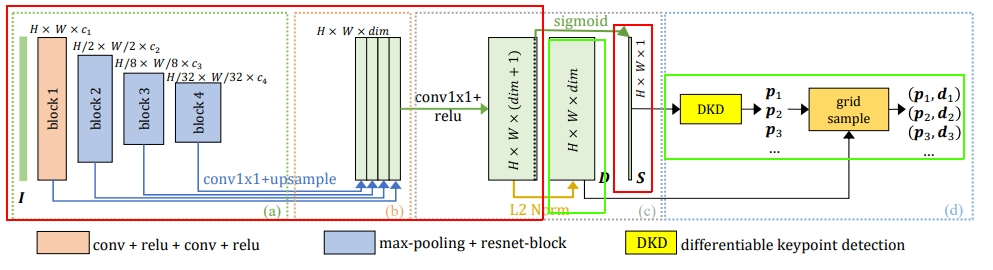

## Links
- ALIKE: https://github.com/Shiaoming/ALIKE
- EdgeAI TIDL: https://github.com/TexasInstruments/edgeai-tidl-tools
- Texas Instruments: https://github.com/TexasInstruments

# ALIKE: Accurate and Lightweight Keypoint Detection and Descriptor Extraction

This repository contains the project of second-year Computer Science students of UCU AСS course.
Our Team:
- Mykhailo Buleshnyi
- Maksym Buleshnyi
- Artur Pelcharskyi
- Davyd Ilnytskyi

Mentors:
- Roman Milishchuk
- Vasyl Borsuk
- Mykola Morhunenko

## Introduction

Image matching is one of the main tasks of 3D Computer
Vision, and is necessary for solving such tasks as Visual localization, Pose Estimation, 3D Reconstruction. It also allows significantly improve the quality of video from the camera through multi-frame super-resolution and video stabilization. That is widely used in autonomous robotics platforms like cars, drones etc. The goal of this project is efficiently running deep learning keypoint extractor ALIKE on single-board computer BeagleBone AI-6.

## BeagleBone

BeagleBoneAI 64 is a powerful single-board computer designed for artificial intelligence (AI) and machine learning (ML) applications. It comes with an Arm Cortex-A15 processor and dual-core Arm Cortex-M4 microcontrollers. The board also includes a TI C66x digital signal processor (DSP) and four embedded vision engine (EVE) cores.


- Processor: Texas Instruments TDA4VM
- GPU: PowerVR® Series8XE GE8430
- SDRAM: LPDDR4 3.2 GHz Q3222PM1WDGTK-U
- Built-in flash memory: eMMC (16GB) Kingston EMMC16G-
TB29-PZ90

## Prerequisites

The required packages are listed in the `requirements.txt`:

```python3
pip install -r requirements.txt
```

## Installation

### Build
```bash
make start force-build=true use-gpu=false
```
* `force-build=true` - rebuilds the image
* `use-gpu=false` - disables GPU support

### Run
```
make exec
```

```bash
python /home/workdir/assets/compile_toy_model.py --onnx_path=/home/workdir/assets/toy_model_opset11.onnx --artifacts_folder=/home/workdir/assets/artifacts compile
python /home/workdir/assets/compile_toy_model.py --onnx_path=/home/workdir/assets/toy_model_opset11.onnx --artifacts_folder=/home/workdir/assets/artifacts inference
```

### Stop
```
make stop
```

## Results

| Model | MMA | MHA | Ex. time | num. of keyp. |
| --- | --- | --- | --- | --- |
| Alike-t | 12.73% | 40% | 1.09 | 1017 |
| Alike-n | 13.70% | 40% | 2.48 | 726 |
| Alike-l | 15.38% | 50% | 4.5 | 403 |

ALIKE model posses different configuration: alike-t, alike-
n, alike-l. They are ordered in ascending order with respect to their accuracy and execution time. As our prior goal to optimize algorithm to make it possible to use it for realtime task we decided to take configuration of alike



After that, the model was divided into two parts. In the images above, the part that can be completely optimized using TIDL is depicted in red, Step 1. In green, the areas that cannot be optimized completely, Step 2. Step 2 consists of Normalization and DKD. You can find more information in our [paper](https://www.overleaf.com/project/65e83c944189b6665887bb0e).

After dividing the model into two logical parts, we get the following initial time measurement:

| Total time | Step 1 | Step 2 | Normalization | DKD | Other |
| --- | --- | --- | --- | --- | --- |
| 1.72 | 1.09 | 0.63 | 0.29 | 0.26 | 0.08 |

Step 2 time is counted as Normalization + DKD + Other

Now consider the time after the optimization of the first step.

| Total time | Step 1 | Step 2 | Normalization | DKD | Other |
| --- | --- | --- | --- | --- | --- |
| 0.79 | 0.16 | 0.63 | 0.29 | 0.26 | 0.08 |

Above is the time after 8 bit conversion. 16 bit conversion takes 0.19 seconds, but the quantization for 8 bit conversion did not lose much accuracy, so we chose it.

Now we it is resonable to optimize DKD block in particular Non-maximum suppression (NMS).
NMS block it is chain of Maxpool layers that takes significant part of time of execution. 
- So at first we converted Maxpool layer to ONNX format and used instead of original layer, converted one. Overall time boost of NMS block is from 0.25 to 0.05s. That is 5 time faster!!!
- In NMS block there is two itaration of Maxpool operations. After removing one we noticed that almost no changes in accuracy. So after this change we got from 0.05s to 0.03s.
- In addition some unnecessary copying where found in model. After removing them total time of model inference reduced by 0.06 seconds.

| Total time | Step 1 | Step 2 | Normalization | DKD | Other |
| --- | --- | --- | --- | --- | --- |
| 0.51 | 0.16 | 0.35 | 0.29 | 0.04 | 0.02 |

Therefore, the increase in speed is 3.4X, and in FPS from 0.58 FPS to 1.97 FPS.


## Conclusion

In this project we got overall boost in x times. Certainly
there is some other optimization that can be done, but they
will not change time of execution significantly. In this project main optimization was using Edge AI TIDL library also some memory and code manipulation was done. Overall boost in performance enables to use this approach for real time problems.