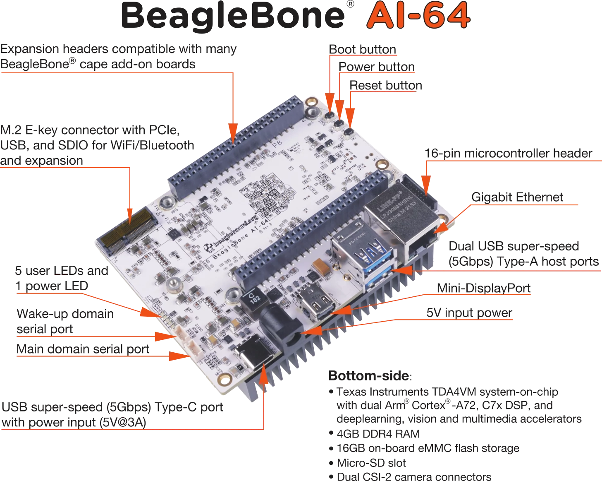

## Links
- ALIKE: https://github.com/Shiaoming/ALIKE
- EdgeAI TIDL: https://github.com/TexasInstruments/edgeai-tidl-tools
- Texas Instruments: https://github.com/TexasInstrumentsx

# ALIKE: Accurate and Lightweight Keypoint Detection and Descriptor Extraction

This repository contains the project of second-year Computer Science students of UCU AСS course.
Our Team:
- Mykhailo Buleshnyi
- Maksym Buleshnyi
- Artur Pelcharsky
- Davyd Ilnytsky

Mentors:
- Roman Milishchuk
- Vasyl Borsuk
- Mykola Morhunenko

## Introduction

Image matching is one of the main tasks of 3D Computer
Vision, and is necessary for solving such tasks as Visual localization, Pose Estimation, 3D Reconstruction. It also allows significantly improve the quality of video from the camera through multi-frame super-resolution and video stabilization. That is widely used in autonomous robotics platforms like cars, drones etc. The goal of this project is efficiently running deep learning keypoint extractor ALIKE on single-board computer BeagleBone AI-6.

## BeagleBone

BeagleBoneAI 64 is a powerful single-board computer designed for artificial intelligence (AI) and machine learning (ML) applications. It comes with an Arm Cortex-A15 processor and dual-core Arm Cortex-M4 microcontrollers. The board also includes a TI C66x digital signal processor (DSP) and four embedded vision engine (EVE) cores.



- Processor: Texas Instruments TDA4VM
- GPU: PowerVR® Series8XE GE8430
- SDRAM: LPDDR4 3.2 GHz Q3222PM1WDGTK-U
- Built-in flash memory: eMMC (16GB) Kingston EMMC16G-
TB29-PZ90

## Prerequisites

The required packages are listed in the `requirements.txt`:

```python3
pip install -r requirements.txt
```

## Installation

### Build
```bash
make start force-build=true use-gpu=false
```
* `force-build=true` - rebuilds the image
* `use-gpu=false` - disables GPU support

### Run
```
make exec
```

```bash
python /home/workdir/assets/compile_toy_model.py --onnx_path=/home/workdir/assets/toy_model_opset11.onnx --artifacts_folder=/home/workdir/assets/artifacts compile
python /home/workdir/assets/compile_toy_model.py --onnx_path=/home/workdir/assets/toy_model_opset11.onnx --artifacts_folder=/home/workdir/assets/artifacts inference
```

### Stop
```
make stop
```

## Examples

## Conclusion